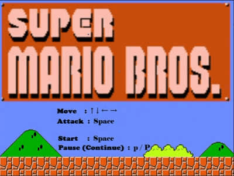

这是我在大一用 C++编写的超级玛丽小游戏（借鉴了网上各种资料），贴图使用了 easyX。

在 `c++超级玛丽` 文件夹里面，pdf 文件记录了开发时间，word 中记录了开发过程，里面包含了 vs 的整个项目文件

- 注意：我是在 Windows 下的 `Beta 版：使用Unicode UTF-8 提供的全球语言支持` 的语言环境下开发的，所以如果运行后界面是黑的需要修改 Windows 的语言环境

下面是部分展示：

